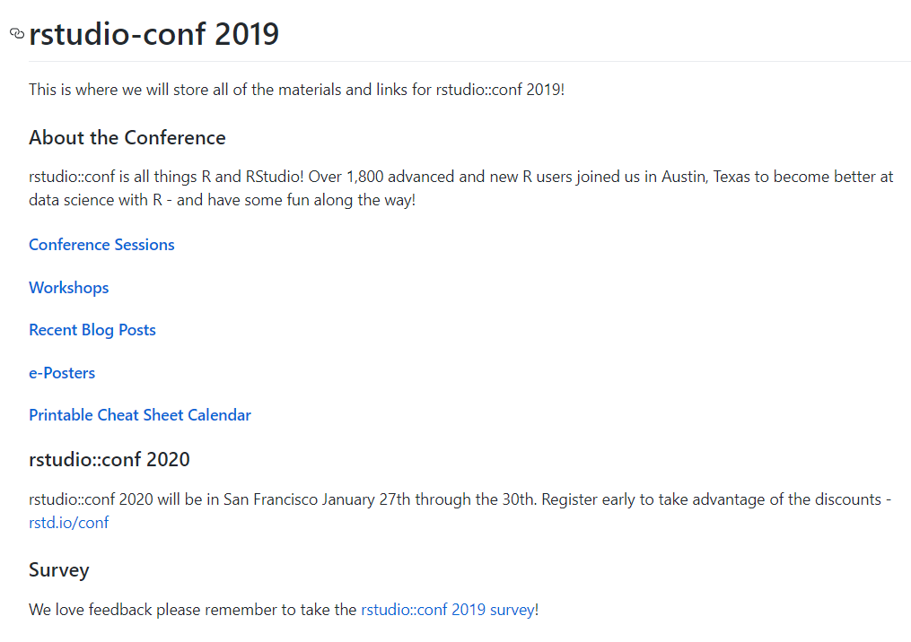
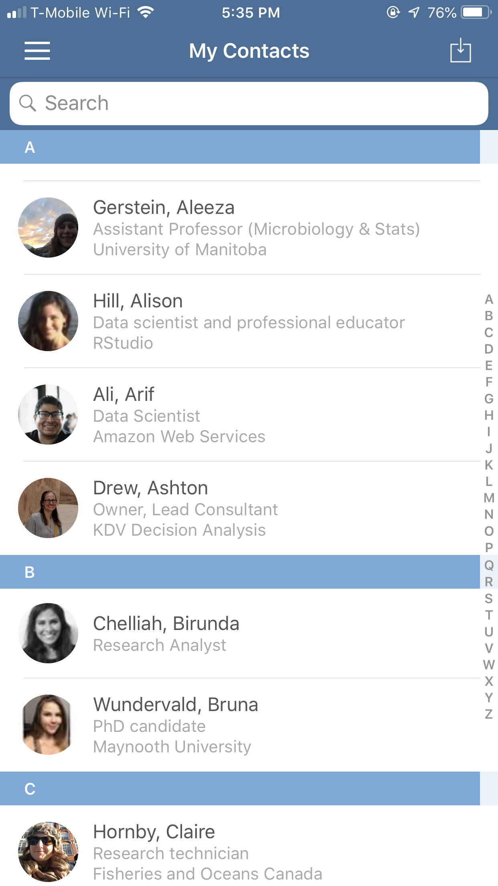
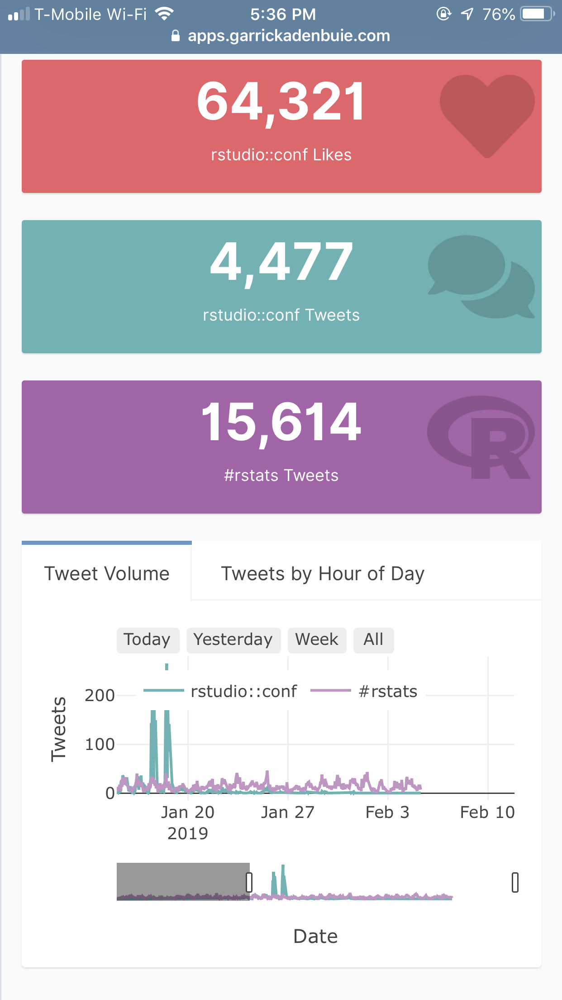
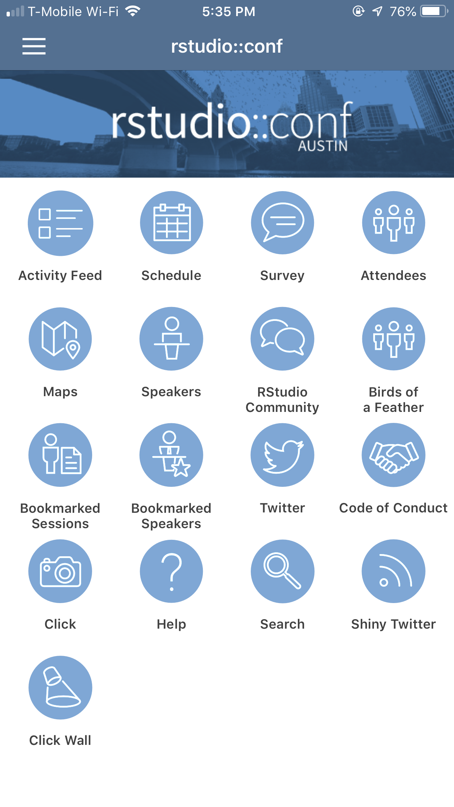
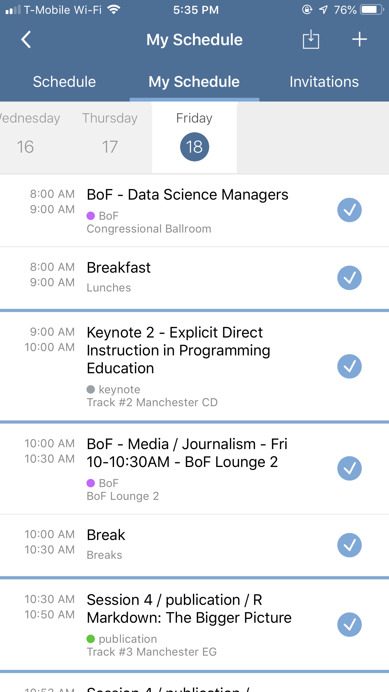
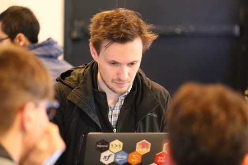
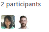
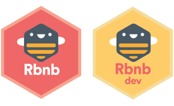

```{r setup, include=FALSE}
options(htmltools.dir.version = FALSE)
knitr::opts_chunk$set(tidy = FALSE, 
                      eval = FALSE, tidy.opts=list(width.cutoff=40))
```

# `rstudio::conf` materials:
https://github.com/rstudio/rstudio-conf



---
# Workshops 


---
# Advanced R Markdown	


---
# Advanced R Markdown	


--


---
# My impression of all the talks: `Shiny`
- Push straight to prod: API development with R and Tensorflow at T-Mobile.

 

- Shiny Phones: Analyzing Call Detail `Records in Prosecution`.

- The Future's Shiny: Dashboards for Pioneering `Genomic Medicine` in R.

- Building a highly flexible `enterprise-wide reporting system` using R Shiny.

- Using Shiny and D3 to explore `EHR and biobank data` as a network. Application and lessons in developing robust, modular, and scalable shiny apps.

---
# RStudio Conference APP






---
# Tidyverse Dev Day `r emo::ji("thinking")`


--

--


---
# A question asker -> A Tidyverse contributor


--

`Step 1. Find an issue`
  - Issues tagged tidy-dev-day
  
  - Issues tagged help-wanted
  
  - Issues tagged reprex

---
# Tidyverse Dev Day

`Step 2. Claim it`

 - 

--

`Step 3. Make a pull request (PR)!`

 - Basic knowledge with Git
 
 - Fork and clone the package then create `New Branch`
 
 

--
 - Push and Pull 
 
 

---
# First PR and First Merge

.pull-top[
 
]

--
.pull-bottom[
 
]

---
# Why is it important to contribute? 

### For work



--
### For yourself


--
### For the community


---
class: center, middle

# Thanks! and Keep in touch
<br>

### `r icon::fa("twitter")` [@zhiiiyang](https://twitter.com/laeRusers)
### `r icon::fa("github")`  [zhiiiyang](https://github.com/laeRusers/)
### `r icon::fa("envelope")`  [zyang895@gmail.com](mailto:laerug@gmail.com)

<br>

Slides created via the R package [**xaringan**](https://github.com/yihui/xaringan)
